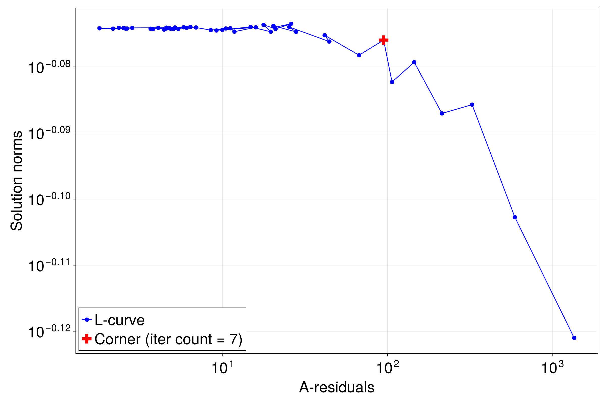

# Example: Custom GP and L-Curve for Optimal Regularization

This example demonstrates how to generate a synthetic dataset from a `CustomGP` with covariance:

$$
\Sigma(s, t) = 2 \sin\left(\frac{\pi s}{2}\right) \sin\left(\frac{\pi t}{2}\right), \quad 0 \le s, t \le 1,
$$

and use the iterative LSQR solver. Then, we find an optimal regularization point (i.e., iteration count) by plotting the "L-curve".

## How to Run This Example

1.  Navigate to this directory in your terminal.
2.  Launch Julia and activate the local environment:
    ```sh
    julia --project=.
    ```
3.  From the Julia REPL, run the script:
    ```julia
    include("run_lcurve.jl")
    ```
This will generate the output video `spline_lcurve.png` in this directory.

## Result

The script produces the following L-curve plot. The red cross marks the "corner" identified by the algorithm, corresponding to the optimal iteration number for the LSQR solver in this case.

